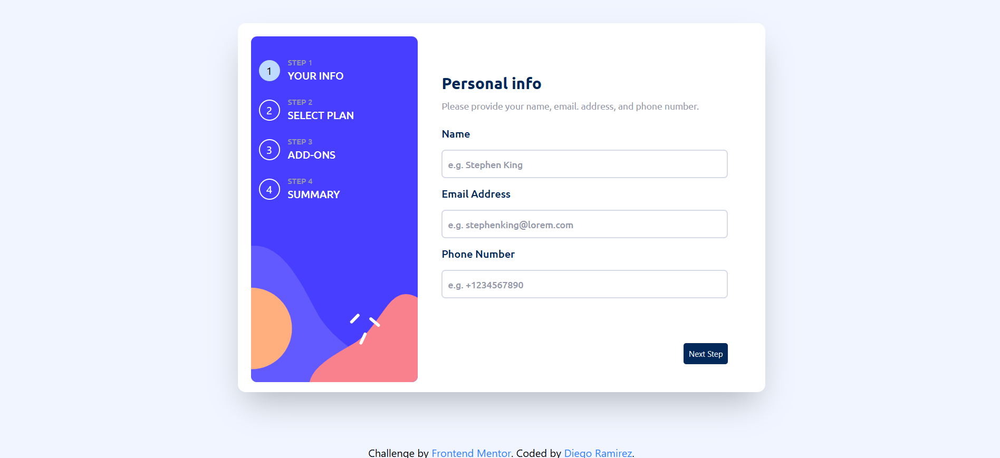

# Frontend Mentor - Multi-step form solution

This is a solution to the [Multi-step form challenge on Frontend Mentor](https://www.frontendmentor.io/challenges/multistep-form-YVAnSdqQBJ). Frontend Mentor challenges help you improve your coding skills by building realistic projects. 

## Table of contents

- [Overview](#overview)
  - [The challenge](#the-challenge)
  - [Screenshot](#screenshot)
  - [Links](#links)
- [My process](#my-process)
  - [Built with](#built-with)
  - [What I learned](#what-i-learned)
  - [Continued development](#continued-development)
- [Author](#author)

## Overview

### The challenge

Users should be able to:

- Complete each step of the sequence
- Go back to a previous step to update their selections
- See a summary of their selections on the final step and confirm their order
- View the optimal layout for the interface depending on their device's screen size
- See hover and focus states for all interactive elements on the page
- Receive form validation messages if:
  - A field has been missed
  - The email address is not formatted correctly
  - A step is submitted, but no selection has been made

### Screenshot




### Links

- Solution URL: [github](https://github.com/Diego2Drm/multi-step-form)
- Live Site URL: [multi-step-form](https://diego2drm.github.io/multi-step-form/)

## My process

### Built with

- Semantic HTML5 markup
- CSS custom properties
- Flexbox
- Mobile-first workflow
- [React](https://reactjs.org/) - JS library
- [Tailwind CSS v4.1](https://tailwindcss.com/) - For styles
- [react-router-dom](https://reactrouter.com/upgrading/v6) - For navigation

### What I learned
  -Custom Hook --> useContext().

```js
import { useContext } from "react"
import { Context } from "../context/MyContext"

const useMyContext = () => {
  return useContext(Context)
};

export { useMyContext };
```

### Continued development
- react-router-dom.
- tailwind css.
- forms.
- useState.


## Author

- Website - [Diego Ramírez](https://diego2drm.github.io/Portafolio/)
- Frontend Mentor - [@Diego2Drm](https://www.frontendmentor.io/profile/Diego2Drm)
- Gmail - [diego.ramirez2d03@gmail.com]
